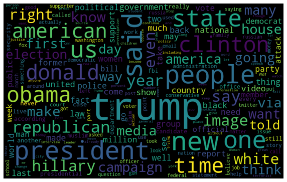
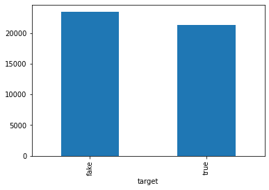
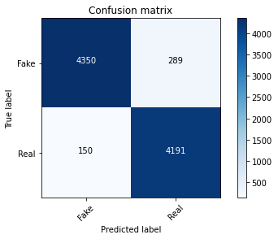
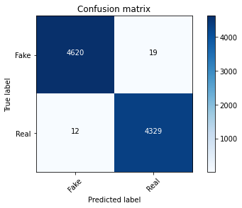
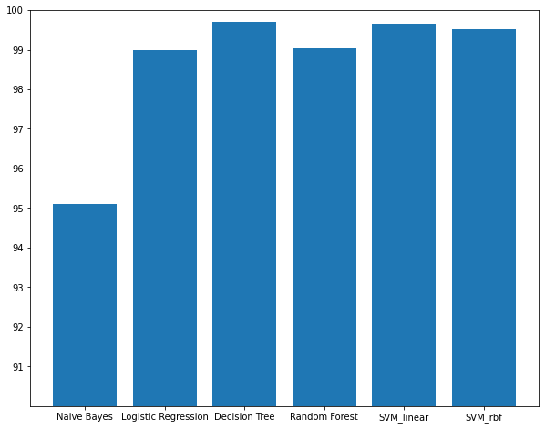

# Fake News Classification using Traditional Machine Learning Models


### Contributors
- Thura Aung

### Problem Statement  

Fake news detection is still in the early age of development, and there are still many challenging issues that need further investigations. It is necessary to discuss potential research directions that can improve fake news detection and mitigation capabilities. Binary classification is done by using different machine learning algorithms.

* [Project proposal](Image/proposal.pdf)
* [Project report](Image/report.pdf)

### Dataset 

Dataset Link : https://www.kaggle.com/clmentbisaillon/fake-and-real-news-dataset

- The dataset cites the following articles for acknowledgments: 
 - Ahmed H, Traore I, Saad S. “Detecting opinion spams and fake news using text classification”,  Journal of Security and Privacy, Volume 1, Issue 1, Wiley, January/February 2018. 
 - Ahmed H, Traore I, Saad S. (2017) “Detection of Online Fake News Using N-Gram Analysis and  Machine Learning Techniques. In: Traore I., Woungang I., Awad A. (eds) Intelligent, Secure, and  Dependable Systems in Distributed and Cloud Environments. ISDDC 2017. Lecture Notes in  Computer Science, vol 10618. Springer, Cham (pp. 127-138). 

- True and Fake articles 


* True.csv: A full dataset containing true news
  * title: the title of a news article
  * text: the text of the article; could be incomplete
  * subject: the subject of the article 
  * date: date of the news
  * target: label of the article - true or fake

* Fake.csv: A full dataset with all the same attributes at True.csv but containing fake news

### Data Preprocessing process
  
  * Concatenate True.csv and Fake.csv for data preparation
  * Drop unnecesssary columns
  * Convert to lower cases
  * Remove punctuation
  * Remove stopwords
  * Tokenize
  * Train/Test split with 80:20 ratio
  * Vectorize
  * Feature Extraction with Tfidf

### File Structure
The file structure is the following
```
.
|
+-- requirements.txt
+-- modelling
|   +-- data
    |   +-- True.csv
    |   +-- Fake.csv
|   +-- [ML]fake-news-classification.ipynb
|   +-- train.ipynb
```

### Install requirements
```{r, engine='bash', count_lines}
$ pip install -r requirements.txt
```

### Train Decision Tree Classifier on preprocessed Data

```{r, engine='bash', count_lines}
$ runipy train.ipynb
```

### Confusion matrices of different classifiers

- Confusion matrix of Naive Bayes


- Confusion matrix of Logistic Regreesion


- Confusion matrix of Decision Tree


- Confusion matrix of Random Forest


- Confusion matrix of Linear SVM


- Confusion matrix of SVM with RBF kernel


### Comparing Accuracies of Machine Learning Models

| Model                     | Accuracy     |
|:-------------------------:|:------------:|
| Naive Bayes               | 95.11%       |
| Logistic Regression       | 98.98%       |
| Decision Tree             | 99.69%       |
| Random Forest             | 99.04%       |
| Linear SVM                | 99.65%       |
| SVM with RBF kernel       | 99.52%       |

### Conclusion



- I incresed accuracy as well as f1-scores than the paper original dataset mentioned in the acknowledgement.
- Data preprocessing and TFIDF make machine learning classifiers more precise.
- Decision Tree Classifier would be the best fit on the dataset.

### Future works 

- This repository is for Udacity Machine Learning Engineer Nanodegree and only to use educational purpose.
- Demonstration App : [Fake News Classifiers by Aly Boolani](https://github.com/AlyBoolani/Fake-News-Classifier) on the same dataset I used. ( We used different preprocessing approaches )
- Fake news classification for Burmese language

### References

  * [Fake News Identification - Stanford CS229](http://cs229.stanford.edu/proj2017/final-reports/5244348.pdf)
  * [Machine Learning for Detection of Fake News](https://dspace.mit.edu/bitstream/handle/1721.1/119727/1078649610-MIT.pdf)
  * [Fake News Classification](https://github.com/SauravMaheshkar/Fake-News-Classification)
  * [Datasets from Kaggle](https://www.kaggle.com/clmentbisaillon/fake-and-real-news-dataset)
